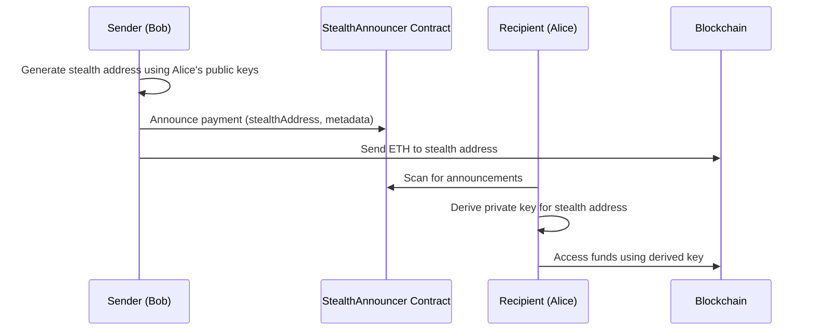

# GUN-ETH


## Table of Contents

1. [DESCRIPTION](#description)
2. [SMART CONTRACTS](#smart-contracts)
3. [KEY FEATURES](#key-features)
4. [HOW TO INSTALL](#how-to-install)
5. [HOW TO USE](#how-to-use)
6. [HOW IT WORKS](#how-it-works)  
7. [CORE FUNCTIONS](#core-functions)
8. [PROOF OF INTEGRITY](#proof-of-integrity)
9. [STEALTH ADDRESSES](#stealth-addresses)
10. [LOCAL DEVELOPMENT](#local-development)
11. [SECURITY CONSIDERATIONS](#security-considerations)
12. [CONTRIBUTING](#contributing)
13. [LICENSE](#license)

## DESCRIPTION

Gun-eth is a plugin for GunDB that integrates Ethereum and Web3 functionality. This plugin extends GunDB's capabilities by allowing interaction with the Ethereum blockchain, providing cryptographic signature management, proof of integrity, and stealth address features.

## SMART CONTRACTS

- **ProofOfIntegrity Contract** (Optimism Sepolia): [address]
- **StealthAnnouncer Contract** (Optimism Sepolia): [address]

Currently deployed on Optimism Sepolia testnet.

## KEY FEATURES

- **Ethereum Signature Verification**: Verify Ethereum signatures for messages
- **Password Generation**: Generate secure passwords from Ethereum signatures
- **Encrypted Key Pair Management**: Create, store, and retrieve encrypted key pairs
- **Proof of Integrity**: Verify data integrity on-chain
- **Stealth Addresses**: Private transaction capabilities
- **Hybrid Storage**: Support for both on-chain and off-chain data storage

## PROOF OF INTEGRITY

The Proof of Integrity system allows you to:
- Store data with cryptographic proof on-chain
- Verify data hasn't been tampered with
- Track data modifications
- Maintain an immutable audit trail

Example usage:
```javascript
// Write data with proof
gun.proof("localhost", null, { message: "Hello, blockchain!" }, (ack) => {
  if (ack.ok) {
    console.log("Data written with proof:", ack.nodeId);
  }
});

// Verify data
gun.proof("localhost", nodeId, null, (ack) => {
  if (ack.ok) {
    console.log("Data verified on blockchain");
  }
});
```

## LOCAL DEVELOPMENT

1. Install dependencies:
```bash
yarn install
```

2. Start local Hardhat node:
```bash
yarn start-node
```

3. Deploy contracts:
```bash
yarn deploy-local
```

4. Run examples:
```bash
# Test stealth addresses
yarn test-stealth

# Test proof of integrity
yarn test-proof
```

## HOW TO INSTALL

```bash
npm install gun-eth
```

```javascript
import gun from "gun";
import "gun-eth";

const gun = Gun();

await gun.generatePassword("YOUR_SIGNATURE");
```

## HOW TO USE

Learn more about Gun.js [here](https://gun.eco/docs/Getting-Started).

Learn more about plugin implementation [here](https://github.com/amark/gun/wiki/Adding-Methods-to-the-Gun-Chain#abstraction-layers).


## HOW IT WORKS

### Create KeyPair


[](https://mermaid.live/edit#pako:eNpdUUtuwjAQvcrIGzZwgSwqJSRQhEorwqZNWLjxkFgkduSPEAJu1Fv0Yp0khaj1wh6P3s_jCyu0QBawQ61PRcWNg12cKxhWmK2T97dwtYVlskm24W71utnDbPYE0SWVpUIDJdLOHQIHSx3uvEE4SVdBJS2ceF2juz0Eo458Tb-_rjDPlnfqGs8tl2agpUm4f-DnvVmcJaow59aBq_6hR09vpSqh9OqvQtwrJGQ2sBU9F7TqgHEEEzpm6KoJEGjiLRrbl1wIg9aOMkkvs8hSp8kLhzgo4PgbRnaKn3E0MhY945miiz2bsgZNw6WgSV86SM4oTIM5C6gU3Bxz1rfVjbDcO52eVcECZzxOmdG-rFhw4LWlm28FDS2WvDS8eXRRSIr2Mnxm_6dT1nL1ofUdc_sBNpWchQ)

### Retrive KeyPair
----

[](https://mermaid.live/edit#pako:eNplUsluwjAQ_ZWRz_ADObQCEiggOLAc2iQHN56ABbGjsU2FAv_erBBBLs7Yb5lnT8ESLZB5LD3rv-TIycLOjxSU3yjc7kabnQcbtCTxgrDEa84lxTAcfsC42BskyElfpEADXAhCU65KgJEHxa0j_Lw3WuOKcvtGc4NJ-NBDldA1tyjg1ChDSjqDmVP-OG6Ik9rLL4J3qHZKdPr-Uz8IfayxD6QzUh26RnvNtRZBbTEtWprUCoxLkjJL6s6dwfRpMKsCOFIg8KWnuI9d6xt8dVAk0uTBXvHfM4LVHTfut18x5i-M9spBadskjvsXWjEWL4yVNHXe7j00vSWe1YmXYbD2nw7Uvkrn8NWAmmLeLxZNwQYsQ8q4FOX4FNVRxOwRM4yYV_4KTqeI1dvqXmK5s3p7VQnzLDkcMNLucGReys-mrFwuuEVf8gPx7LGLQlpNq2ZC60EdsJyrH607zP0f6c7pXw)

## CORE FUNCTIONS

- `verifySignature(message, signature)`: Verifies an Ethereum signature for a given message.

  ```javascript
  const recoveredAddress = await gun.verifySignature(message, signature);
  ```

- `generatePassword(signature)`: Generates a password from an Ethereum signature.

  ```javascript
  const password = gun.generatePassword(signature);
  ```

- `createSignature(message)`: Creates an Ethereum signature for a message.

  ```javascript
  const signature = await gun.createSignature(message);
  ```

- `createAndStoreEncryptedPair(address, signature)`: Creates and stores an encrypted key pair.

  ```javascript
  await gun.createAndStoreEncryptedPair(address, signature);
  ```

- `getAndDecryptPair(address, signature)`: Retrieves and decrypts a stored key pair.

  ```javascript
  const decryptedPair = await gun.getAndDecryptPair(address, signature);
  ```

- `shine(chain, nodeId, data, callback)`: Implements SHINE for data verification and storage on the blockchain.

  ```javascript
  gun.shine("optimismSepolia", nodeId, data, callback);
  ```
  
## SECURITY CONSIDERATIONS

- Use a secure Ethereum provider (e.g., MetaMask) when interacting with functions that require signatures.
- Generated passwords and key pairs are sensitive. Handle them carefully and avoid exposing them.
- Keep Gun.js and Ethereum dependencies up to date for security.
- Be aware of gas costs associated with blockchain interactions when using SHINE.

## Contributing

We welcome contributions! Please open an issue or submit a pull request on GitHub.

## License

This project is released under the MIT license.

## Contact

For questions or support, please open an issue on GitHub: https://github.com/scobru/gun-eth

## STEALTH ADDRESSES

### Simple Explanation
Stealth addresses allow you to receive payments without revealing your actual Ethereum address to anyone. It's like having a secret mailbox that only you can access, but anyone can send mail to. Each time someone wants to send you ETH, they generate a new, unique address that only you can unlock.

### Key Benefits
- **Privacy**: Your real address is never exposed
- **Unlinkability**: Each payment uses a different address
- **Security**: Only you can access the funds
- **Decentralized**: Works without any central server

### Technical Details
The stealth address system implements a protocol similar to Umbra, using:

1. **Key Pairs**:
   - Viewing Key Pair: For decrypting payment notifications
   - Spending Key Pair: For accessing received funds

2. **Protocol Flow**:


3. **Key Components**:
   - **StealthAnnouncer Contract**: Manages payment announcements on-chain
   - **GunDB Integration**: Stores encrypted key pairs and metadata
   - **ECDH**: For shared secret generation
   - **Key Derivation**: For stealth address generation

### Usage Example

```javascript
// Setup recipient (Alice)
await gun.createAndStoreEncryptedPair(aliceAddress, aliceSignature);

// Generate stealth address (Bob)
const stealthInfo = await gun.generateStealthAddress(aliceAddress, bobSignature);

// Announce payment (Bob)
await gun.announceStealthPayment(
  stealthInfo.stealthAddress,
  stealthInfo.senderPublicKey,
  stealthInfo.spendingPublicKey,
  bobSignature,
  { onChain: true }
);

// Recover funds (Alice)
const recoveredWallet = await gun.recoverStealthFunds(
  stealthAddress,
  senderPublicKey,
  aliceSignature,
  spendingPublicKey
);
```

### Features
- **Hybrid Storage**: Supports both on-chain and off-chain announcements
- **Dev Fee System**: Optional fee system for protocol sustainability
- **Batch Processing**: Efficient scanning of multiple announcements
- **Key Recovery**: Secure key pair backup and recovery
- **Multi-chain Support**: Ready for deployment on any EVM chain

### Security Considerations
- Keep your viewing and spending keys secure
- Never reuse stealth addresses
- Verify contract addresses before interacting
- Consider gas costs for on-chain announcements
- Use appropriate entropy for key generation

For more technical details, check the [StealthAnnouncer.sol](./src/contracts/StealthAnnouncer.sol) contract and [stealth.js](./src/node/stealth.js) implementation.
