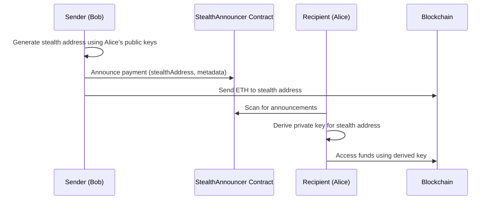

# GUN-ETH


## Table of Contents

1. [Description](#description)
2. [Smart Contracts](#smart-contracts)
3. [Key Features](#key-features)
4. [Installation](#installation)
5. [Usage](#usage)
6. [How It Works](#how-it-works)
7. [Core Functions](#core-functions)
8. [Proof of Integrity](#proof-of-integrity)
9. [Stealth Addresses](#stealth-addresses)
10. [Local Development](#local-development)
11. [Security Considerations](#security-considerations)
12. [Contributing](#contributing)
13. [License](#license)

## Description

Gun-eth is a plugin for GunDB that integrates Ethereum and Web3 functionality. This plugin extends GunDB's capabilities by enabling interaction with the Ethereum blockchain, providing cryptographic signature management, proof of integrity, and stealth address features.

## Smart Contracts

- **ProofOfIntegrity Contract** (Optimism Sepolia): [address]
- **StealthAnnouncer Contract** (Optimism Sepolia): [address]

Currently deployed on Optimism Sepolia testnet.

## Key Features

- **Ethereum Signature Verification**: Verify Ethereum signatures for messages
- **Password Generation**: Generate secure passwords from Ethereum signatures
- **Encrypted Key Pair Management**: Create, store, and retrieve encrypted key pairs
- **Proof of Integrity**: Verify data integrity on-chain
- **Stealth Addresses**: Private transaction capabilities
- **Hybrid Storage**: Support for both on-chain and off-chain data storage

## Installation

```bash
npm install gun-eth
```

```javascript
import gun from "gun";
import "gun-eth";

const gun = Gun();

await gun.generatePassword("YOUR_SIGNATURE");
```

## Usage

Learn more about Gun.js [here](https://gun.eco/docs/Getting-Started).

Learn more about plugin implementation [here](https://github.com/amark/gun/wiki/Adding-Methods-to-the-Gun-Chain#abstraction-layers).


## How It Works

### Create KeyPair


[](https://mermaid.live/edit#pako:eNpdUUtuwjAQvcrIGzZwgSwqJSRQhEorwqZNWLjxkFgkduSPEAJu1Fv0Yp0khaj1wh6P3s_jCyu0QBawQ61PRcWNg12cKxhWmK2T97dwtYVlskm24W71utnDbPYE0SWVpUIDJdLOHQIHSx3uvEE4SVdBJS2ceF2juz0Eo458Tb-_rjDPlnfqGs8tl2agpUm4f-DnvVmcJaow59aBq_6hR09vpSqh9OqvQtwrJGQ2sBU9F7TqgHEEEzpm6KoJEGjiLRrbl1wIg9aOMkkvs8hSp8kLhzgo4PgbRnaKn3E0MhY945miiz2bsgZNw6WgSV86SM4oTIM5C6gU3Bxz1rfVjbDcO52eVcECZzxOmdG-rFhw4LWlm28FDS2WvDS8eXRRSIr2Mnxm_6dT1nL1ofUdc_sBNpWchQ)

### Retrive KeyPair
----

[](https://mermaid.live/edit#pako:eNplUsluwjAQ_ZWRz_ADObQCEiggOLAc2iQHN56ABbGjsU2FAv_erBBBLs7Yb5lnT8ESLZB5LD3rv-TIycLOjxSU3yjc7kabnQcbtCTxgrDEa84lxTAcfsC42BskyElfpEADXAhCU65KgJEHxa0j_Lw3WuOKcvtGc4NJ-NBDldA1tyjg1ChDSjqDmVP-OG6Ik9rLL4J3qHZKdPr-Uz8IfayxD6QzUh26RnvNtRZBbTEtWprUCoxLkjJL6s6dwfRpMKsCOFIg8KWnuI9d6xt8dVAk0uTBXvHfM4LVHTfut18x5i-M9spBadskjvsXWjEWL4yVNHXe7j00vSWe1YmXYbD2nw7Uvkrn8NWAmmLeLxZNwQYsQ8q4FOX4FNVRxOwRM4yYV_4KTqeI1dvqXmK5s3p7VQnzLDkcMNLucGReys-mrFwuuEVf8gPx7LGLQlpNq2ZC60EdsJyrH607zP0f6c7pXw)

## Core Functions

- `verifySignature(message, signature)`: Verifies an Ethereum signature for a given message.

  ```javascript
  const recoveredAddress = await gun.verifySignature(message, signature);
  ```

- `generatePassword(signature)`: Generates a password from an Ethereum signature.

  ```javascript
  const password = gun.generatePassword(signature);
  ```

- `createSignature(message)`: Creates an Ethereum signature for a message.

  ```javascript
  const signature = await gun.createSignature(message);
  ```

- `createAndStoreEncryptedPair(address, signature)`: Creates and stores an encrypted key pair.

  ```javascript
  await gun.createAndStoreEncryptedPair(address, signature);
  ```

- `getAndDecryptPair(address, signature)`: Retrieves and decrypts a stored key pair.

  ```javascript
  const decryptedPair = await gun.getAndDecryptPair(address, signature);
  ```

- `shine(chain, nodeId, data, callback)`: Implements SHINE for data verification and storage on the blockchain.

  ```javascript
  gun.shine("optimismSepolia", nodeId, data, callback);
  ```
  
## Security Considerations

- Use a secure Ethereum provider (e.g., MetaMask) when interacting with functions that require signatures.
- Generated passwords and key pairs are sensitive. Handle them carefully and avoid exposing them.
- Keep Gun.js and Ethereum dependencies up to date for security.
- Be aware of gas costs associated with blockchain interactions when using SHINE.

## Contributing

We welcome contributions! Please open an issue or submit a pull request on GitHub.


## Stealth Addresses

### Simple Explanation
Stealth addresses allow you to receive payments without revealing your actual Ethereum address to anyone. It's like having a secret mailbox that only you can access, but anyone can send mail to. Each time someone wants to send you ETH, they generate a new, unique address that only you can unlock.

### Key Benefits
- **Privacy**: Your real address is never exposed
- **Unlinkability**: Each payment uses a different address
- **Security**: Only you can access the funds
- **Decentralized**: Works without any central server

### Technical Details
The stealth address system implements a protocol similar to Umbra, using:

1. **Key Pairs**:
   - Viewing Key Pair: For decrypting payment notifications
   - Spending Key Pair: For accessing received funds

2. **Protocol Flow**:


3. **Key Components**:
   - **StealthAnnouncer Contract**: Manages payment announcements on-chain
   - **GunDB Integration**: Stores encrypted key pairs and metadata
   - **ECDH**: For shared secret generation
   - **Key Derivation**: For stealth address generation

### Usage Example

```javascript
// Setup recipient (Alice)
await gun.createAndStoreEncryptedPair(aliceAddress, aliceSignature);

// Generate stealth address (Bob)
const stealthInfo = await gun.generateStealthAddress(aliceAddress, bobSignature);

// Announce payment (Bob)
await gun.announceStealthPayment(
  stealthInfo.stealthAddress,
  stealthInfo.senderPublicKey,
  stealthInfo.spendingPublicKey,
  bobSignature,
  { onChain: true }
);

// Recover funds (Alice)
const recoveredWallet = await gun.recoverStealthFunds(
  stealthAddress,
  senderPublicKey,
  aliceSignature,
  spendingPublicKey
);
```

### Features
- **Hybrid Storage**: Supports both on-chain and off-chain announcements
- **Dev Fee System**: Optional fee system for protocol sustainability
- **Batch Processing**: Efficient scanning of multiple announcements
- **Key Recovery**: Secure key pair backup and recovery
- **Multi-chain Support**: Ready for deployment on any EVM chain

### Security Considerations
- Keep your viewing and spending keys secure
- Never reuse stealth addresses
- Verify contract addresses before interacting
- Consider gas costs for on-chain announcements
- Use appropriate entropy for key generation

For more technical details, check the [StealthAnnouncer.sol](./src/contracts/StealthAnnouncer.sol) contract and [stealth.js](./src/node/stealth.js) implementation.

## Proof of Integrity

The Proof of Integrity system provides on-chain verification of data integrity using smart contracts. This feature allows you to:

- Store cryptographic proofs of data on-chain
- Verify data hasn't been tampered with
- Track data modifications
- Maintain an immutable audit trail

### How It Works

1. When data is written:
   - Data is stored in GunDB
   - A content hash is generated
   - The hash is stored on-chain via smart contract
   - The original data remains in GunDB

2. When data is verified:
   - The current data is hashed
   - The hash is compared with on-chain record
   - Timestamp and updater info is retrieved
   - Any modifications are detected

### Example Usage

```javascript
// Write data with proof
gun.proof("localhost", null, { message: "Hello, blockchain!" }, (ack) => {
  if (ack.ok) {
    console.log("Data written with proof:", ack.nodeId);
  }
});

// Verify data integrity
gun.proof("localhost", nodeId, null, (ack) => {
  if (ack.ok) {
    console.log("Data verified on blockchain");
    console.log("Last update:", new Date(ack.timestamp * 1000));
    console.log("Updated by:", ack.updater);
  }
});
```

### Batch Operations

You can also verify multiple nodes at once:

```javascript
gun.proof("localhost", null, [
  { nodeId: "id1", data: "data1" },
  { nodeId: "id2", data: "data2" }
], callback);
```

## Local Development

1. Clone the repository:
```bash
git clone https://github.com/scobru/gun-eth
cd gun-eth
```

2. Install dependencies:
```bash
yarn install
```

3. Start local Hardhat node:
```bash
yarn start-node
```

4. Deploy contracts:
```bash
yarn deploy-local
```

5. Build the project:
```bash
yarn build
```

6. Run examples:
```bash
# Test stealth addresses
yarn test-stealth

# Test proof of integrity
yarn test-proof
```

### Environment Setup

Create a `.env` file with:

```env
PRIVATE_KEY=your_private_key
RPC_URL=your_rpc_url
CHAIN_ID=your_chain_id
```

### Testing

The project includes several test examples:

- `examples/eth2gun.html`: Browser demo for key pair management
- `examples/proof.html`: Browser demo for proof of integrity
- `examples/stealth-example.js`: Node.js demo for stealth addresses
- `examples/proof-example.js`: Node.js demo for proof of integrity

## Bundle Information

The project is bundled using Rollup and provides three different formats:

1. **UMD Bundle** (Browser)
   - File: `dist/gun-eth.min.js`
   - Usage: 
   ```html
   <script src="dist/gun-eth.min.js"></script>
   ```

2. **ES Module**
   - File: `dist/gun-eth.esm.js`
   - Usage:
   ```javascript
   import GunEth from 'gun-eth';
   ```

3. **CommonJS**
   - File: `dist/gun-eth.cjs.js`
   - Usage:
   ```javascript
   const GunEth = require('gun-eth');
   ```

## API Reference

### Core Methods

| Method | Description | Parameters | Returns |
|--------|-------------|------------|---------|
| `verifySignature` | Verifies an Ethereum signature | `message`, `signature` | `Promise<address>` |
| `generatePassword` | Generates password from signature | `signature` | `string` |
| `createSignature` | Creates an Ethereum signature | `message` | `Promise<string>` |
| `createAndStoreEncryptedPair` | Creates and stores key pair | `address`, `signature` | `Promise<void>` |
| `getAndDecryptPair` | Retrieves stored key pair | `address`, `signature` | `Promise<Object>` |
| `proof` | Manages proof of integrity | `chain`, `nodeId`, `data`, `callback` | `Gun` |

### Stealth Methods

| Method | Description | Parameters | Returns |
|--------|-------------|------------|---------|
| `generateStealthAddress` | Generates stealth address | `recipientAddress`, `signature` | `Promise<Object>` |
| `announceStealthPayment` | Announces payment | `stealthAddress`, `senderPublicKey`, `spendingPublicKey`, `signature` | `Promise<void>` |
| `recoverStealthFunds` | Recovers funds from stealth address | `stealthAddress`, `senderPublicKey`, `signature` | `Promise<Object>` |

## Security Considerations

1. **Key Management**
   - Store private keys securely
   - Never expose signatures or passwords
   - Use hardware wallets when possible

2. **Network Security**
   - Use secure RPC endpoints
   - Implement rate limiting
   - Validate all input data

3. **Smart Contract Interaction**
   - Verify contract addresses
   - Check gas costs before transactions
   - Monitor for contract upgrades

4. **Data Privacy**
   - Use stealth addresses for sensitive transactions
   - Encrypt sensitive data before storage
   - Regularly rotate keys

## Contributing

1. Fork the repository
2. Create your feature branch (`git checkout -b feature/amazing-feature`)
3. Commit your changes (`git commit -m 'Add amazing feature'`)
4. Push to the branch (`git push origin feature/amazing-feature`)
5. Open a Pull Request

### Development Guidelines

- Follow JavaScript Standard Style
- Add tests for new features
- Update documentation
- Maintain backward compatibility

## Support

For support, please:

1. Check the [documentation](https://github.com/scobru/gun-eth#readme)
2. Search [existing issues](https://github.com/scobru/gun-eth/issues)
3. Create a new issue if needed

## License

This project is released under the MIT license.

## Contact

For questions or support, please open an issue on GitHub: https://github.com/scobru/gun-eth

## Acknowledgments

- [GunDB](https://gun.eco/) team
- [Ethereum](https://ethereum.org/) community
- All contributors
